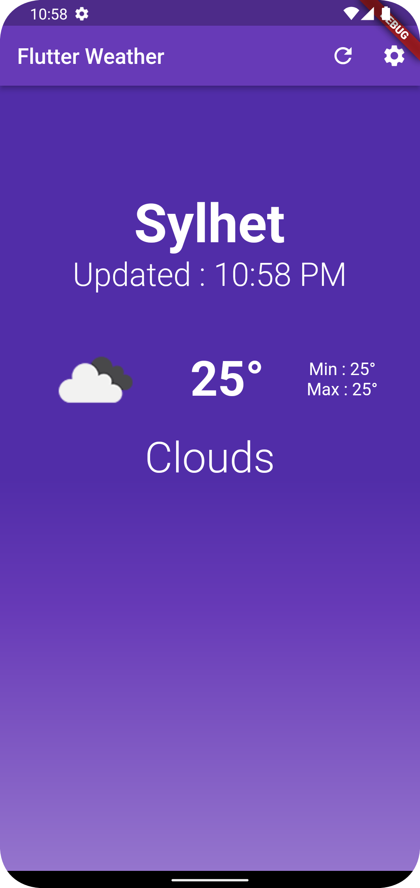

# Simple Weather

Be sure to replace YOUR_API_KEY

Create a simple weather app that fetches and displays the current weather conditions for a user's location.

Requirements

The app should display the user's current location and the current weather conditions, including the temperature and weather description (e.g. sunny, cloudy, etc.) with a descriptive image of the weather.

The app shows a loading indicator when data is being fetched from the api.

The app should display an error message if there is a problem fetching the weather data.

You may use a custom font for the temperature and weather description.

You can use the OpenWeatherMap API or any free weather API to fetch weather data.

              
